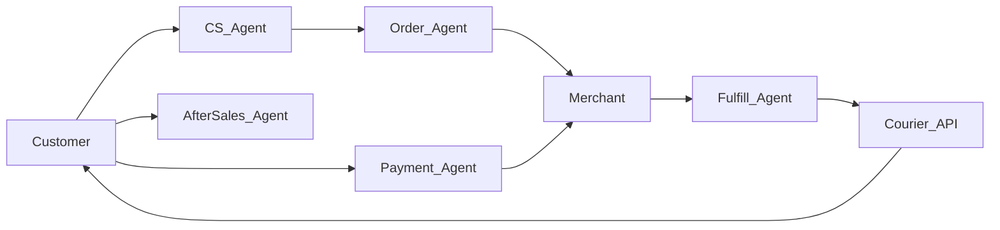
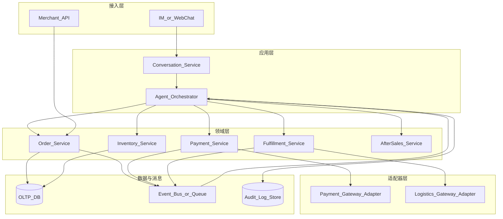

# AI-Agent 买卖系统 PRD（MVP + 工程落地纲要）

## 1. 文档信息

- 文档版本：v1.1
- 文档日期：2026-03-30
- 产品阶段：MVP（首版可上线闭环）+ 工程实现说明（便于研发排期与拆分任务）
- 适用对象：产品、研发、测试、运维、运营、合规与安全

## 2. 背景与目标

传统买卖链路（客服接单、商家发货、物流揽收、客户签收、商家收款）跨系统、跨角色，人工衔接成本高，状态易断点。  
本项目目标是通过多智能体协作，把交易流程串成一个可追踪、可审计、可人工接管的自动化闭环。

### 2.1 业务目标（MVP）

- 提升订单自动流转率，减少人工重复操作。
- 缩短客户咨询到下单的平均时长。
- 提高履约过程状态透明度（订单、物流、结算全链路可查）。
- 建立高风险节点的人审机制，确保资金与履约安全。

### 2.2 范围边界（MVP 默认）

- 单商家、单店铺。
- 国内快递（先接 1 家承运商 API）。
- 主流支付渠道（先接 1 家支付渠道）。
- 支持基础售后入口（退货退款规则先做简化版）。

### 2.3 非目标（Out of Scope，避免范围蔓延）

- 多租户 SaaS 级隔离与计费（可作为二期）。
- 复杂营销引擎（满减叠加、券池、拼团等）。
- 全渠道统一（淘宝/京东/抖音店铺一键同步），MVP 仅支持自有会话入口 + 自有下单链路。
- 强合规支付托管（如需 PCI DSS 全量认证，需单独安全评估）。

### 2.4 工程落地原则（研发共识）

- **状态机是唯一真相源**：订单/支付/物流状态变更只能由领域服务 + 明确事件驱动，Agent 不直接改库绕过校验。
- **工具化边界**：LLM 只通过「工具/API」执行业务动作；高风险工具默认关闭或需人审令牌。
- **幂等与可回放**：支付回调、物流回调、Agent 重试均带幂等键；关键事件可重放审计。
- **可观测优先**：每笔订单贯穿 `trace_id`，外部回调与 Agent 决策同链路透传。

## 3. 用户与角色

## 3.1 外部角色

- 商家：管理商品、审核关键动作、发货确认、收款对账。
- 客户：咨询、下单、支付、查物流、确认收货、申请售后。
- 快递服务商：接收揽件请求，回传轨迹状态。
- 支付服务商：支付结果、退款结果、对账流水回传。

## 3.2 智能体角色

- 客服Agent（CS_Agent）：处理咨询、澄清需求、引导下单。
- 订单Agent（Order_Agent）：创建订单、校验库存、推动支付。
- 履约Agent（Fulfill_Agent）：触发发货、生成物流单、同步物流状态。
- 支付Agent（Payment_Agent）：支付状态监听、收款确认、退款编排。
- 售后Agent（AfterSales_Agent）：受理售后、触发规则、转人工审批。
- 对账Agent（Reconcile_Agent）：日结对账、异常账单告警。

## 4. 核心业务流程

### 4.1 端到端流程说明

1. 客户咨询：客服Agent识别意图并推荐商品。
2. 客户下单：订单Agent创建订单并锁定库存。
3. 客户支付：支付Agent拉起支付并等待支付回调。
4. 商家出货：履约Agent生成发货任务，商家确认发货。
5. 快递揽收：履约Agent提交揽件，持续同步轨迹。
6. 客户签收：状态流转到“已签收”。
7. 收款确认：支付Agent确认资金状态，对账Agent入账。
8. 售后（可选）：售后Agent按规则处理或转人工。

### 4.2 逻辑架构（可实现的拆分方式，MVP 推荐）

MVP 建议 **单体或「少量服务」**：把复杂度放在「领域服务 + 事件 + Agent 编排」，而不是先拆很多微服务。可按以下逻辑模块划分，后续再物理拆分。

**模块职责简述**

| 模块 | 职责 | 与 Agent 关系 |
|---|---|---|
| Conversation_Service | 会话、消息存储、多轮上下文、会话与 `customer_id` 绑定 | 为 CS_Agent 提供上下文与工具调用上下文 |
| Agent_Orchestrator | 意图识别、路由、工具调用、HITL 挂起/恢复 | 不直接写库，只调领域 API |
| Order_Service | 订单创建、状态机、取消、幂等 | Order_Agent 的唯一下单入口 |
| Inventory_Service | 库存查询、预占、支付成功扣减、取消回补 | 与订单状态强一致 |
| Payment_Service | 支付单创建、回调验签、退款、对账流水 | Payment_Agent 只读状态 + 触发支付 |
| Fulfillment_Service | 发货单、运单、物流轨迹订阅/轮询 | Fulfill_Agent 触发 |
| AfterSales_Service | 售后单、审批流占位 | AfterSales_Agent 写入草稿，人审后执行 |

## 5. 状态机设计（MVP）

## 5.1 订单状态

- `created`：订单创建
- `pending_payment`：待支付
- `paid`：已支付
- `pending_fulfillment`：待发货
- `shipped`：已发货
- `in_transit`：运输中
- `delivered`：已送达
- `completed`：交易完成
- `cancelled`：已取消
- `after_sales`：售后中
- `refunded`：已退款

## 5.2 支付状态

- `unpaid` / `paying` / `paid` / `refund_pending` / `refunded` / `failed`

## 5.3 物流状态

- `waybill_created` / `picked_up` / `in_transit` / `signed` / `exception`

## 6. 功能需求

## 6.1 客服与下单（P0）

- 多轮会话理解：识别咨询、购买、催发货、售后等意图。
- 商品问答：价格、库存、规格、发货时效自动回复。
- 下单引导：确认商品、数量、地址、联系方式后创建订单。
- 风险词拦截：异常请求（改价、改收款账户）必须转人工。

## 6.2 订单与库存（P0）

- 订单创建、查询、取消。
- 库存校验与预占。
- 支付前后状态原子流转（防重复扣减）。

## 6.3 履约与物流（P0）

- 发货任务创建与商家确认。
- 调用快递 API 创建运单。
- 物流轨迹回传与状态同步。
- 物流异常告警（超时未揽收、异常签收）。

## 6.4 支付与结算（P0）

- 支付发起、支付回调接收。
- 收款确认与订单状态联动。
- 日结对账与差异告警。

## 6.5 售后（P1）

- 退货退款申请入口。
- 售后规则自动判定（简化版：签收后 N 天内可申请）。
- 高金额退款必须人工审批。

## 7. Agent 职责矩阵与输入输出

| Agent | 输入 | 输出 | 关键约束 |
|---|---|---|---|
| CS_Agent | 客户消息、商品信息 | 结构化意图、下单草稿 | 不可承诺超出库存/时效 |
| Order_Agent | 下单草稿、库存状态 | 订单号、待支付单 | 不可跳过库存校验 |
| Fulfill_Agent | 已支付订单、地址 | 运单号、物流状态 | 不可在未支付时发货 |
| Payment_Agent | 订单号、支付回调 | 支付状态、结算记录 | 不可修改收款账户 |
| AfterSales_Agent | 售后申请、订单状态 | 售后单、审批建议 | 超阈值必须转人工 |
| Reconcile_Agent | 支付流水、订单流水 | 对账报告、异常清单 | 每日定时执行并留痕 |

## 8. HITL（Human-in-the-Loop）人工介入规则

以下场景必须人工确认后才能继续：

- 改价、改收款账户、线下转账请求。
- 高价值订单（阈值可配置，如 >= 3000 元）。
- 高金额退款（阈值可配置，如 >= 1000 元）。
- 物流异常（拒收、丢件、长时间停滞）。
- 模型低置信度回复（置信度低于阈值）。

人工接管要求：

- 一键接管当前会话与工单。
- 回写处理结果到系统状态流。
- 保留完整审计日志（谁在何时做了什么动作）。

## 9. 非功能需求

## 9.1 可用性与性能

- 核心链路可用性目标：99.9%（MVP 可按 99.5% 逐步达成）。
- 客服响应延迟：P95 < 3 秒（不含外部 API 抖动）。
- 状态更新最终一致性：通常 < 10 秒。

## 9.2 安全与合规

- 全链路鉴权（Agent 与系统服务均需身份校验）。
- 敏感数据加密存储（手机号、地址、支付标识）。
- 关键动作审计日志保留。
- 支付与隐私遵循本地法规和平台规范。

## 9.3 可观测性

- 每个订单生成全链路 Trace ID。
- 记录 Agent 决策输入、输出、置信度和执行结果。
- 建立告警：支付失败率、物流异常率、人工介入率。

## 10. 指标体系（上线后评估）

## 10.1 业务指标

- 下单转化率
- 支付成功率
- 履约及时率
- 退款率

## 10.2 智能体指标

- 自动闭环率（无人工介入完成比例）
- 人工介入率（按场景拆分）
- 误判率（错误执行高风险动作次数）
- 会话满意度（客服场景）

## 10.3 运营指标

- 平均响应时长
- 平均履约时长
- 异常单处理时长

## 11. 风险与应对

| 风险 | 影响 | 应对策略 |
|---|---|---|
| 物流 API 不稳定 | 状态延迟或错误 | 重试机制、超时回退、人工兜底 |
| 支付回调丢失 | 订单卡在待支付 | 主动补单轮询、幂等更新 |
| 模型误判 | 错误自动执行 | 高风险动作强制人审、置信度阈值 |
| 恶意下单/薅羊毛 | 资金与库存损失 | 风控规则、频控、黑名单 |
| 数据不一致 | 对账差异 | 每日对账、异常工单闭环 |

## 12. 优先级与里程碑

## 12.1 功能优先级（P0/P1）

| 模块 | 需求 | 优先级 |
|---|---|---|
| 客服 | 意图识别+下单引导 | P0 |
| 订单 | 创建/取消/状态流转 | P0 |
| 库存 | 下单预占与回补 | P0 |
| 支付 | 支付回调+收款确认 | P0 |
| 履约 | 发货与物流同步 | P0 |
| 审计 | 关键动作留痕 | P0 |
| 售后 | 退货退款自动流转 | P1 |
| 对账 | 自动差异定位与建议修复 | P1 |
| 运营看板 | 实时指标面板 | P1 |

## 12.2 里程碑建议

- M1（2-3 周）：打通咨询-下单-支付-发货最小闭环（单承运商/单支付）。
- M2（2 周）：完善人工介入、审计与异常告警。
- M3（2 周）：上线售后简版与基础对账能力。

## 13. MVP 验收标准（Given/When/Then）

1. Given 有库存商品，When 客户确认购买，Then 系统在 3 秒内创建订单并返回订单号。
2. Given 订单待支付，When 收到支付成功回调，Then 订单状态变更为 `paid` 且生成结算记录。
3. Given 已支付订单，When 商家确认发货，Then 系统生成运单并进入 `shipped`。
4. Given 运单已签收，When 客户确认收货，Then 订单进入 `completed`。
5. Given 高金额退款申请，When 售后Agent处理，Then 必须转人工审批后才能退款。

## 14. 工程实现纲要（研发可直接拆任务）

本节把 PRD 落到「能建仓库、能列接口、能写表结构」的粒度；具体技术栈可替换，但边界建议保留。

### 14.1 推荐技术选型（仅供参考，非强制）

| 层级 | 建议选项 | 说明 |
|---|---|---|
| 后端语言 | Python 3.11+ / Node.js 20+ | 与 Agent 生态 Python 友好；Node 也可做网关 |
| API | REST + Webhook | 支付/物流回调用 HTTPS + 验签 |
| 实时 | WebSocket / SSE | 客服会话与 Agent 流式回复 |
| 数据库 | PostgreSQL | 事务与状态机友好 |
| 缓存 | Redis | 会话、幂等键、分布式锁（预占库存） |
| 消息 | Redis Streams / RabbitMQ / Kafka（按规模） | 订单事件、异步回调、物流轮询 |
| Agent 编排 | LangGraph / 自研状态机 + Tool 层 | 必须能「暂停等人审」 |
| 可观测 | OpenTelemetry + 结构化日志 | `trace_id` 贯穿 |

### 14.2 核心数据模型（表/实体级，MVP）

| 实体 | 关键字段（示例） | 说明 |
|---|---|---|
| merchant | id, name, status | MVP 单商家可硬编码一条 |
| product | id, name, description, status | 商品主数据 |
| sku | id, product_id, price_cent, stock, attrs_json | 价格与库存 |
| customer | id, phone_hash, open_id | 客户身份 |
| address | id, customer_id, detail, is_default | 收货地址 |
| conversation | id, customer_id, channel, status | 会话 |
| message | id, conversation_id, role, content, meta_json | 消息与 Agent 元数据 |
| order | id, customer_id, status, amount_cent, idempotency_key | 订单 |
| order_item | order_id, sku_id, qty, price_cent | 明细 |
| inventory_hold | id, order_id, sku_id, qty, expire_at | 预占（支付超时释放） |
| payment_intent | id, order_id, provider, status, amount_cent, idempotency_key | 支付单 |
| payment_event | id, payment_intent_id, raw_payload_ref, signature_ok | 回调留痕 |
| shipment | id, order_id, status, courier_code | 发货单 |
| waybill | id, shipment_id, tracking_no, status | 运单 |
| logistics_event | id, waybill_id, event_time, raw_json | 轨迹 |
| after_sales_ticket | id, order_id, type, status, amount_cent | 售后 |
| audit_log | id, actor_type, actor_id, action, payload_json, trace_id | 审计 |

### 14.3 对外与对内 API（示例清单）

**对内（领域服务，供 Agent 工具调用）**

- `POST /api/v1/orders`：创建订单（body：sku、qty、address_id；返回 order_id）
- `POST /api/v1/orders/{id}/cancel`：取消（未支付/未发货规则）
- `POST /api/v1/payments/intents`：创建支付意图（绑定 order_id）
- `POST /api/v1/fulfillments/{order_id}/ship`：商家确认发货（生成 shipment）
- `POST /api/v1/waybills`：创建运单（对接物流适配器）
- `POST /api/v1/after-sales`：创建售后单

**对外 Webhook（适配器接收）**

- `POST /webhooks/payments/{provider}`：支付成功/失败/退款（验签 + 幂等）
- `POST /webhooks/logistics/{provider}`：轨迹推送（若承运商支持）

**会话与 Agent**

- `POST /api/v1/conversations/{id}/messages`：用户发消息
- `GET /api/v1/conversations/{id}/stream`：流式返回（SSE）

### 14.4 事件与一致性（工程必做）

- **订单状态迁移**：仅允许合法迁移（如 `pending_payment` -> `paid`），非法迁移拒绝并记审计。
- **库存预占**：创建订单时 `hold`，支付超时 TTL 释放；支付成功转 `deduct`；取消订单 `release`。
- **幂等**：`Idempotency-Key` 请求头（下单、创建支付、退款）；Webhook 用 `provider_event_id` 去重。
- **Outbox 模式**（可选但推荐）：订单/支付状态变更写入 outbox 表，异步投递到消息队列，Agent 与通知服务消费同一事件流，避免「库写成功、消息没发」双写问题。

### 14.5 Agent 工具（Tool）边界示例

| 工具名 | 允许调用方 | 行为 | 默认策略 |
|---|---|---|---|
| `search_products` | CS_Agent | 只读检索 | 允许 |
| `create_order_draft` | CS_Agent | 生成结构化草稿 | 允许 |
| `commit_order` | Order_Agent | 调领域 API 创建订单 | 需校验草稿与库存 |
| `create_payment` | 系统/Order_Agent | 仅生成支付意图 | 允许 |
| `mark_shipped` | 商家/Fulfill_Agent | 发货 | 需人工或商家确认（可配置） |
| `refund` | AfterSales_Agent | 发起退款 | 高金额强制 HITL |

### 14.6 部署与环境（MVP）

- 单环境：`dev` / `staging` / `prod` 三分离；生产启用 HTTPS 与密钥轮换。
- 配置项：`PAYMENT_*`、`LOGISTICS_*`、`LLM_API_KEY`、`JWT_SECRET`、`WEBHOOK_SIGNING_SECRET`。
- 容器：Docker Compose 一键起（API + DB + Redis + Worker）；Chroma 若用于知识库可独立部署。

### 14.7 测试策略（最低可接受）

- **状态机单测**：覆盖所有合法/非法迁移。
- **幂等单测**：重复支付回调、重复物流事件。
- **契约测试**：支付/物流适配器用 mock server（如 VCR 或固定 JSON）。
- **Agent 回归集**：固定对话集（黄金集）评估意图与工具调用是否越权。

## 15. 新颖方向与可探索创新（产品差异化）

以下方向在「可落地」基础上增加差异化，可按优先级做成 PoC。

1. **因果式交易助手（Causal-style）**：不只回答用户问题，而是显式维护「订单假设图」（如地址未确认、库存未锁），用户每句话只更新图，系统在缺口补齐后才允许 `commit_order`，降低误下单。
2. **可执行策略 DSL**：商家用低代码配置「发货 SLA、超时自动催付、异常自动转人工」的策略，Agent 只解释策略，执行引擎保证确定性。
3. **人机协同队列（HITL 2.0）**：把待办按「风险分 × 收益 × 超时」排序，而不是 FIFO；商家后台只处理 Top-N。
4. **物流数字孪生简版**：对承运商 ETA 做置信区间预测（历史轨迹 + 规则），在「预计送达」前自动触发客户提醒，降低纠纷。
5. **对账 Agent 的「差异解释」**：不只报警，还生成「最可能原因 + 建议修复动作」（如重复回调、金额分位误差），减少财务排查时间。
6. **联邦记忆（可选）**：会话与订单知识进入向量库（如 Chroma），但**支付与隐私字段**永不入库，仅存结构化表；检索时做字段级过滤。
7. **仿真沙箱**：上线前用历史订单回放，对 Agent 策略做离线仿真，输出「自动介入率/误操作率」预估。

## 16. 后续扩展方向（非 MVP）

- 多店铺与多商家统一运营。
- 多承运商智能路由与成本优化。
- 动态定价与智能促销。
- 全链路自动化 A/B 实验系统。
